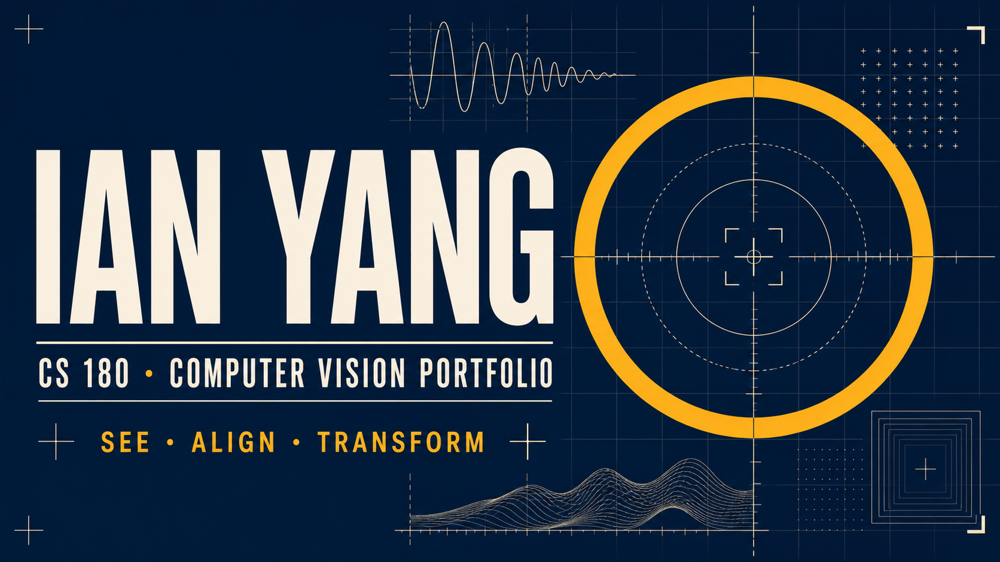

# Ian Yang | UC Berkeley CS 180 Portfolio

> Computer Vision & Computational Photography — selected coursework and visual experiments by Ian Yang, UC Berkeley EECS.

[](https://ian-tc-yang.github.io/cs180/)
[](https://ian-tc-yang.github.io/cs180/resume/ian-yang-resume.pdf)
[](https://www.linkedin.com/in/ian--yang)



## About this portfolio

This repository presents my work from **UC Berkeley CS 180: Introduction to Computer Vision and Computational Photography**. The portfolio is organized as a set of concise, visual case studies so that recruiters, professors, and collaborators can quickly review the problems, methods, experiments, and results behind each project.

The **Final Project** is featured first, followed by Projects 0–4. Individual write-ups are being added progressively; each route and media directory is already prepared for its project content.

## Explore the projects

| Project | Focus | Portfolio page |
| --- | --- | --- |
| **Final Project** | Featured capstone work | [View project](https://ian-tc-yang.github.io/cs180/final/) |
| **Project 0** | Camera & Perspective | [View project](https://ian-tc-yang.github.io/cs180/project0/) |
| **Project 1** | Images of the Russian Empire | [View project](https://ian-tc-yang.github.io/cs180/project1/) |
| **Project 2** | Filters & Frequencies | [View project](https://ian-tc-yang.github.io/cs180/project2/) |
| **Project 3** | Face Morphing | [View project](https://ian-tc-yang.github.io/cs180/project3/) |
| **Project 4** | Image Warping & Mosaics | [View project](https://ian-tc-yang.github.io/cs180/project4/) |

## Portfolio highlights

- Responsive, accessible presentation optimized for desktop and mobile review
- Berkeley-inspired visual system with clear project-first navigation
- Dedicated write-up and media directories for every assignment
- Automated GitHub Pages deployment on every update to `main`
- Direct links to my [résumé](https://ian-tc-yang.github.io/cs180/resume/ian-yang-resume.pdf), [LinkedIn](https://www.linkedin.com/in/ian--yang), and [GitHub profile](https://github.com/Ian-tc-Yang)

## Technology

`React` · `TypeScript` · `Vite` · `HTML/CSS` · `GitHub Actions` · `GitHub Pages`

## Repository structure

```text
cs180/
├── src/                         # React homepage and shared styling
├── public/
│   ├── final/                   # Final project write-up and media
│   ├── project0/ … project4/    # Assignment pages and media folders
│   └── resume/                  # Public résumé PDF
└── .github/workflows/           # Automated Pages deployment
```

## Run locally

```bash
npm install
npm run dev
```

Create a production build with `npm run build`. The GitHub Actions workflow publishes the generated site automatically after changes are pushed to `main`.

---

© Ian Yang · UC Berkeley EECS
